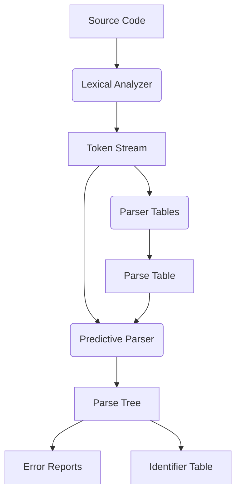

# CPPiler - A C++ Subset Compiler

## Overview

This project implements a lexical analyzer and predictive parser for a subset of C++ syntax. It consists of four core components that work together to analyze code structure, detect syntax errors, and build parse trees.

---

## File Structure

### 1. lexical_analyzer.py

**Purpose**: Tokenizes input source code into lexical tokens.

**Key Components**:
- `Token` Dataclass:
  - Stores token attributes (name, value, position, line, column)
  - Example: `[reservedword, #include, pos=0, ln=1, col=1]`

- `LexicalAnalyzer` Class:
  - **Pattern Definitions**:
    ```python
    patterns = [
        ('reservedword', r'#include|int|float|...'),
        ('identifier', r'[a-zA-Z][a-zA-Z0-9]*'),
        ('number', r'\d+'),
        ('symbol', r'<<|>>|<=|...'),
        ('whitespace', r'[ \t\n]+')
    ]
    ```
  - **Tokenization Logic**:
    - Uses regex to match tokens sequentially
    - Handles line/column tracking
    - Special case for `iostream` as reserved word
    - Skips whitespace while maintaining position

**Execution Flow**:
1. Compile combined regex pattern
2. Iterate through input code
3. Match tokens using regex groups
4. Update positional tracking
5. Generate token stream

---

### 2. parser_tables.py

**Purpose**: Manages grammar rules and constructs parsing tables.

**Key Components**:
- `TokenTableEntry` Dataclass:
  - Stores token metadata with SHA-256 hash

- `ParserTables` Class:
  - **Grammar Definitions**:
    - 22 non-terminals (e.g., `Start`, `Loop`, `Expression`)
    - 56 production rules
    - Terminal/non-terminal mappings
  - **Core Functionality**:
    - Token table management with ordered insertion
    - FIRST/FOLLOW set computation
    - Parse table construction using LL(1) algorithm
  - **Special Handling**:
    - Library includes (`<iostream>`)
    - Compound operators (`<<`, `>>`, `>=`)

**Algorithm Implementation**:
1. Compute FIRST sets:
   - For each non-terminal, determine initial terminals
   - Handle ε (epsilon) productions
2. Compute FOLLOW sets:
   - Determine terminals that can follow non-terminals
3. Build predictive parse table:
   - Resolve FIRST/FOLLOW conflicts
   - Validate LL(1) grammar constraints

---

### 3. predictive_parser.py

**Purpose**: Implements syntax analysis using parse tables.

**Key Components**:
- `ParseTreeNode` Dataclass:
  - Tree structure with parent/child relationships
  - Stores token information for leaf nodes

- `PredictiveParser` Class:
  - **Parsing Logic**:
    - Stack-based parsing algorithm
    - Terminal symbol resolution
    - Production sequence recording
  - **Error Recovery**:
    - Context-aware error messages
    - Position tracking for diagnostics

- `ErrorHandler` Class:
  - Syntax error formatting with source context
  - Line/column calculation
  - Common error patterns:
    - Missing semicolons
    - Invalid assignments
    - Operator mismatches

- `TreeSearcher` Class:
  - Parse tree traversal
  - Identifier definition lookup
  - Variable type resolution

**Parsing Process**:
1. Initialize stack with Start symbol
2. Match terminals against token stream
3. Apply productions from parse table
4. Build parse tree incrementally
5. Handle errors with contextual information

---

### 4. main.py

**Purpose**: Orchestrates compilation process and displays results.

**Key Features**:
- Test code with common C++ constructs:
  - Includes
  - Variable declarations
  - While loops
  - I/O operations
- Phase Execution:
  1. Lexical Analysis
  2. Parse Table Construction
  3. Predictive Parsing
- Diagnostic Outputs:
  - Token table with hashes
  - Parse table visualization
  - Production sequence
  - Identifier definitions
  - Syntax error context

**Output Formatting**:
- Three-column token display
- Terminal/non-terminal mappings
- Error messages with code snippets
- Production sequence numbering

---

## System Architecture



---

## Setup & Usage

**Requirements**:
- Python 3.8+
- `tabulate` package (`pip install tabulate`)

**Execution**:
```bash
python main.py
```

**Expected Output**:
1. Token table with positions
2. Parse table structure
3. Production sequence
4. Identifier definitions
5. Syntax validation status

---

## Error Handling Examples

1. **Missing Operator**:
   ```
   Syntax Error: Expected '<<', found '"sum="'
   Context:
   ->  10 |     cout"sum="<<s;
               ^
   ```

2. **Invalid Assignment**:
   ```
   Syntax Error: Invalid left-hand side in assignment
   Context:
   ->   5 |     3 = x;
               ^
   ```

3. **LL(1) Conflict**:
   ```
   ValueError: Grammar is not LL(1): Conflict at Expression, ==
   ```

---

## Grammar Notes

- **LL(1) Compliant**: No left recursion, deterministic productions
- **Supported Constructs**:
  - Variable declarations
  - Arithmetic operations
  - While loops
  - Console I/O
  - Return statements
- **Limitations**:
  - No function definitions (except main)
  - No class/struct support
  - Limited type system (int/float only)

This implementation demonstrates core compiler construction techniques while handling real C++ syntax patterns with robust error diagnostics.